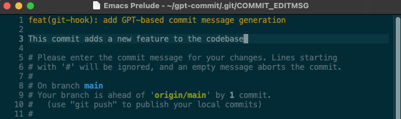

# GPT-Commit: Generate Conventional Commit Messages with GPT in Emacs



GPT-Commit is an Emacs package that automatically generates conventional commit messages using the [GPT (Generative Pre-trained Transformer)](https://openai.com/research/gpt-3) model from OpenAI.

## Table of Contents

- [Installation](#installation)
- [Configuration](#configuration)
- [Usage](#usage)
- [Examples](#examples)
- [Benefits](#benefits)
- [Feedback](#feedback)
- [License](#license)

## Installation

### Via MELPA

If you have MELPA configured, you can easily install `gpt-commit` from within Emacs by running:

```emacs-lisp
M-x package-install RET gpt-commit RET
```

### Manual

To install this package manually, clone this repository and add the following to your `.emacs` or `init.el`:

```emacs-lisp
(add-to-list 'load-path "/path/to/gpt-commit")
(require 'gpt-commit)
```

## Configuration

1. **Set OpenAI API Key**: You will need an API key from OpenAI to use the GPT model. Set the key like this:

```emacs-lisp
(setq gpt-commit-openai-key "YOUR_OPENAI_API_KEY")
```

2. **Set GPT Model Name** (Optional): By default, it uses the `gpt-3.5-turbo` model. If you wish to use a different model, you can set it like this:

```emacs-lisp
(setq gpt-commit-model-name "YOUR_PREFERRED_MODEL_NAME")
```

3. **Add Hook**: Add the `gpt-commit-message` function to the `git-commit-setup-hook` to automatically generate commit messages when the commit message editor starts:

```emacs-lisp
(require 'gpt-commit)
(add-hook 'git-commit-setup-hook 'gpt-commit-message)
```

## Usage

Once you have configured `gpt-commit`, it will automatically generate a commit message using the GPT model whenever you perform a Git commit. You can accept the message by saving and closing the editor, or you can modify the message as needed.

Please note that using the OpenAI API might incur costs, and there might be usage limitations. Be aware of the [OpenAI pricing and policy](https://openai.com/pricing) before extensive use.

## Examples

In our [blog post](https://ywkim.github.io/gpt-commit-real-world-examples-benefits/), we've shared real-world examples of how GPT-Commit works with different types of commits. These examples are based on actual commits from the [Angular project](https://github.com/angular/angular). Here's a quick overview:

- **Documentation Updates**: GPT-Commit accurately identifies that the commit is related to documentation updates and provides more specific information about the update in the commit message.
- **Bug Fixes**: GPT-Commit identifies a bug fix and provides a clear description of the fix in the commit message.
- **Feature Addition**: GPT-Commit correctly identifies the change as a feature addition and provides a clear description of the new feature in the commit message.
- **Dependency Update**: GPT-Commit correctly identifies a dependency update and specifies the packages and version number in the commit message.
- **GitHub Action Update**: GPT-Commit accurately recognizes the commit as a CI configuration update and provides a clear description of the update in the commit message.

For more detailed examples and comparisons with original commit messages, please check out the [blog post](https://ywkim.github.io/gpt-commit-real-world-examples-benefits/).

## Benefits

GPT-Commit offers several benefits to developers:

- **Time-saving**: GPT-Commit automates the task of writing commit messages, saving developers' time.
- **Consistency**: GPT-Commit generates commit messages in a consistent format, making the commit history easier to read and understand.
- **Focus on coding**: With GPT-Commit taking care of commit messages, developers can focus more on coding.

## Feedback

We're always looking to improve GPT-Commit and we'd love to hear your thoughts. If you've used GPT-Commit, please share your experiences. If you haven't, we encourage you to give it a try and let us know what you think. You can provide feedback by creating an issue in our [GitHub repository](https://github.com/ywkim/gpt-commit).

## License

GPT-Commit is licensed under the [GNU General Public License v3.0](LICENSE).
